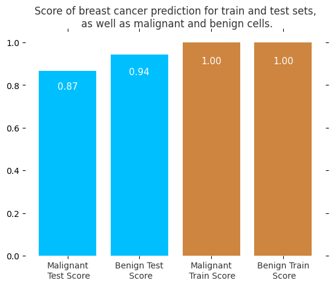
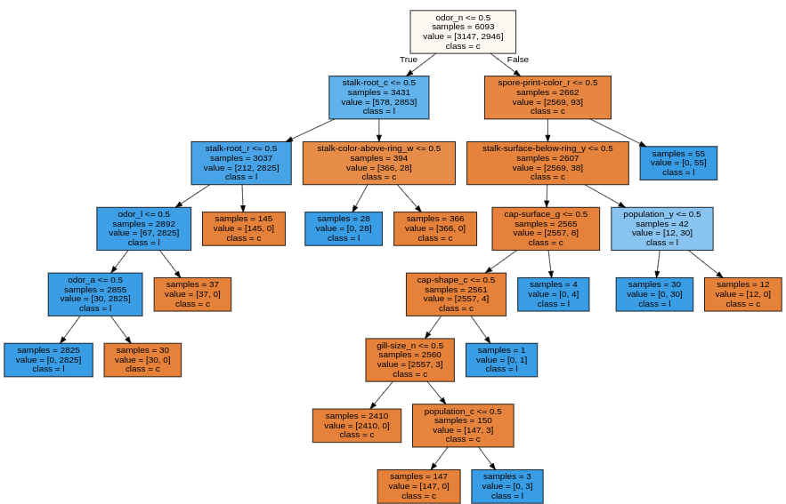
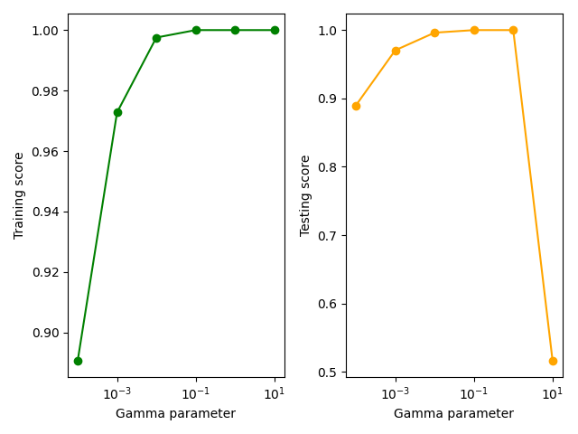

# Applied Machine Learning in Python

This repository contains the topics that were taught in the coursera course [Applied Machine Learning in Python](https://www.coursera.org/learn/python-machine-learning), it contains the assignments as well. These topics and assignments are gathered into different directories, according to weekly aims. The datasets used in the course are located in the Datasets directory of every week. Then each weekly aim is:

## First Week: Fundamentals of Machine Learning - Introduction to Scikit-Learn
This module introduces basic machine learning concepts, tasks, and workflow using an example classification problem based on the K-nearest neighbors method, and implemented using the scikit-learn library. So in the [first Assignment](https://github.com/jpradas1/Applied_Machine-Learning_Python/blob/master/Week_1/Assignment_1.ipynb), in order to implement the K-nearest neighbors model in a real problem, the dataset of breast cancer is trained and tested, where the scores measured, for predicting whether or not the diagnosis is malignant, are shown by the following figure

## Second Week: Supervised Machine Learning
This module delves into a wider variety of supervised learning methods for both classification and regression, learning about the connection between model complexity and generalization performance, the importance of proper feature scaling, and how to control model complexity by applying techniques like regularization to avoid overfitting. In addition to k-nearest neighbors, this week covers linear regression (least-squares, ridge, lasso, and polynomial regression), logistic regression, support vector machines, the use of cross-validation for model evaluation, and decision trees. So for the assignment of this week multiple machine learning model has been fitted, for instance, the following figures shows the classification made by a desicion tree for [UCI Mushroom Dataset](https://archive.ics.uci.edu/ml/datasets/Mushroom?ref=datanews.io), the second figure displays the performance of a Suported Vector Machine (SVC) over a range of one of its hyperparameter 'alpha', it helps to understand what is the optimal configuration for this model.

